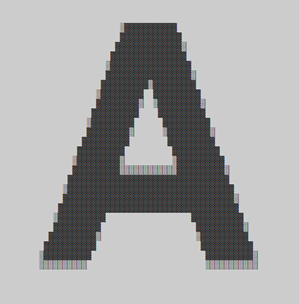

# Image to ASCII converter
A simple image to ASCII converter (using as-pixel characters) made in Typescript and Node.js just for fun, that uses [Jimp](https://github.com/oliver-moran/jimp) to read images easily because use Node.js File System module is a bummer.

Since this program is not a serius project, it is not made for be very interactive or too complex. 

## Build
You just need to run `npm install` for install the project dependencies and then `npm run build` for compile the Typescript code, and it will be ready!.

## Usage
All processed images are stored in the `load/` folder, so you need to move the images that you will convert to that section and then execute:
```
npm start [image name].[image extension]
```

**Supported image types (based on the used image reader capacities)**

The supported image types are:
- gif
- jpeg/jpg
- png
- bmp
- tiff

**Output configuration**

In the `scr/` folder you find the main code (in `index.ts`) and a configuration file (called `outCon.ts`) for output aspects like output resolution or contrast.

## Examples
Here are some arts made with this program:


*Example 1.*


*Example 2.*



*Example 3.*

## License
This project is licenced under the [MIT](https://github.com/Robimati/image-to-ascii/blob/main/LICENCE) Licence. 